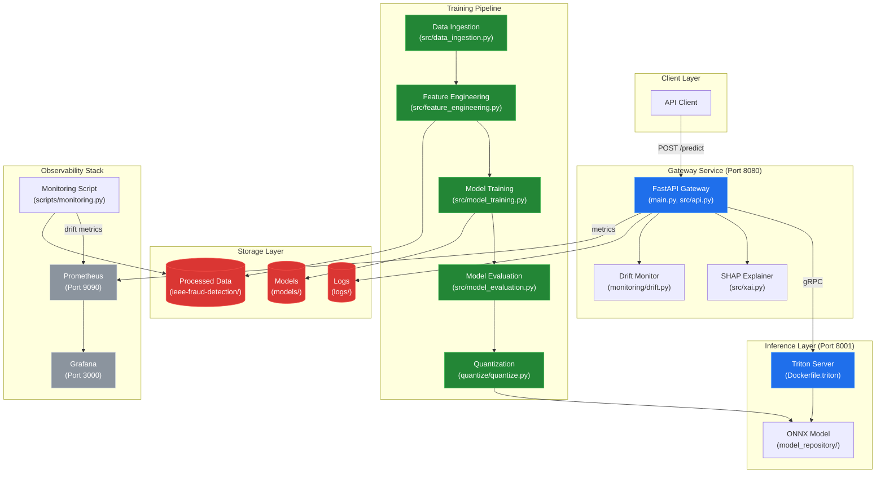
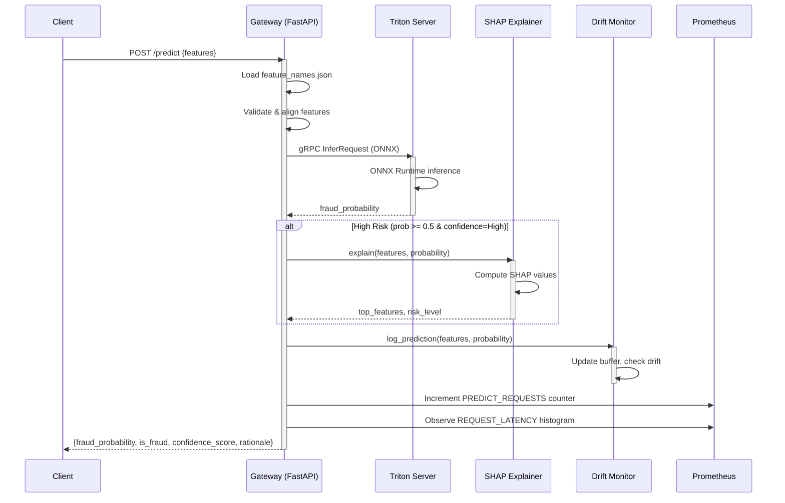

# System Blueprint: suryayalavarthi/Sentinel-Real-Time-Financial-Fraud-Detection-Engine

> 🛡️ High-frequency Fraud Detection Engine with real-time inference (6-8ms) and automated MLOps drift monitoring. $730K+ estimated annual ROI.
>
> Auto-generated on 2026-02-18 by Repo-to-Blueprint Architect

## Project Purpose
Real-time financial fraud detection engine processing transaction data through XGBoost models with sub-10ms inference latency via Triton Inference Server. Provides SHAP-based explainability for high-risk predictions and automated drift monitoring for production MLOps.

## Technical Stack
- **Language**: Python 3.11
- **Framework**: FastAPI (0.110.0+), XGBoost (1.5.0+)
- **Key Dependencies**:
  - ML: scikit-learn, xgboost, shap (0.40.0+)
  - Serving: tritonclient[grpc,http] (2.34.0+), uvicorn (0.27.0+)
  - Quantization: hummingbird-ml (0.4.12), onnx (1.14.0+), onnxruntime (1.15.0+)
  - Monitoring: prometheus-client (0.19.0+), scipy (1.7.0+)
  - Data: pandas (1.3.0+), numpy (1.21.0+)
- **Infrastructure**: Docker (Dockerfile, Dockerfile.gateway, Dockerfile.triton), Docker Compose (docker-compose.yml, docker-compose.ci.yml), GitHub Actions (.github/workflows/smoke-test.yml), Prometheus (prometheus.yml), Grafana

## Architecture Blueprint

## Request Flow

## Evidence-Based Risks

1. **Hardcoded Triton URL Fallback** — `main.py:90` defaults to `triton:8001` if `TRITON_URL` env var missing; no validation that Triton is reachable before accepting traffic, causing silent failures in misconfigured deployments.

2. **Silent Exception Swallowing on Startup** — `main.py:88-99` catches all exceptions during `triton_client`, `xai_explainer`, and `drift_monitor` initialization but sets them to `None` without logging; `/predict` endpoint will raise `HTTPException(500)` on first request instead of failing fast at startup.

3. **Unbounded Drift Monitor Buffer** — `monitoring/drift.py` (referenced in `main.py:97`) uses `buffer_size=10000` with no eviction policy visible in file tree; high-throughput production (6-8ms latency claim) could exhaust memory if buffer grows unchecked.

4. **Missing Model Artifact Validation** — `main.py:85` loads `feature_names.json` but no checksum/version validation against `models/model_metadata.json`; model-feature mismatch could cause silent prediction errors if artifacts desync during deployment.

5. **CI/CD Uses Synthetic Model** — `scripts/generate_ci_model.py` creates minimal ONNX for smoke tests (`.github/workflows/smoke-test.yml:68`); CI passes with fake model, masking real model loading failures until production deployment.

---

## Repository Stats
| Metric | Value |
|--------|-------|
| Total Files | 57 |
| Total Directories | 13 |
| Generated | 2026-02-18 |
| Source | [suryayalavarthi/Sentinel-Real-Time-Financial-Fraud-Detection-Engine](https://github.com/suryayalavarthi/Sentinel-Real-Time-Financial-Fraud-Detection-Engine) |

---

*Generated by Repo-to-Blueprint Architect via n8n*
